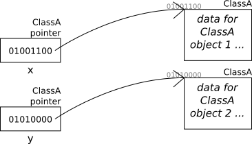

# Introduction & Java Review

The goal of this course is to *learn, understand, and utilize* the fundamental data structures and algorithms in computer science. In particular, we will begin our studies by looking at data structures such as **array lists**, **stacks**, **queues**, **linked-lists** and **hash tables**. In this process, we will examine each from both the perspective of the **user** and the **implementer**. Doing so will allow us to seek out answers questions such as *"What are these data structures and how do I use them in my programs?"* and *"How can we implement them effectively?"*. Then, we will look a the various algorithms ibn computer science. These algorithms will often rely on the implementation of underlying data structures and some problems will have multiple algorithms we can apply.

To aid in our studies, we will use the Java programming language to examine each of the data structures and algorithms. In this process, we will grasp a better understanding of **programming ideas and techniques** utilized in data structure implementation including **object-oriented programming**, **dynamic memory utilization**, **recursion** (with **backtracking**) and other principles. Furthermore, as our programming skills improve, we will be able to utilize the vast capabilities of the Java programming langauge more effectively.

## Java Review
It's is expected that you have previous experience with the Java programming language. That means you must have a mastery of:
- Basic Java program structure and syntax
- Control structures such as loops and conditionals
- Methods and method calls
	- Difference between static and instance methods
	- Concept of method overloading (AKA *ad hoc polymorphism*)
	- Recursive methods
- Variables and objects
	- Difference between Instance and method variables
	- Difference between objects and references
	- Dynamic nature of Java objects
- Classes
	- How to declare new classes
	- Difference between `private`, `public` and `protected` classes
	- Building new classes via **composition** and **inheritance**
	- **Polymorphism** via method overriding and dynamic binding
- Interfaces
- Arrays and array lists (contiguous memory)
- Nodes and linked lists (non-contiguous memory)
- Simple Java files and graphics
- Exception handling

Here, we will briefly look at a some of these topics as a review and a segue.

### Classes and Objects
Recall that  **Classes** are basically **blueprints** for data. For example, we can define a new `Person` class like this: 
```Java
class Person {
	private String name;
	private int age;
	private String address;
	//...
}
```
Note that although we've defined this class, there are no instances of it yet.

Classes are useful because they allow us to  **encapsulate the *data and operations*** together in a new type using *instance data* and *instance methods*. This is important because encapsulation allows us to **restrict acess** (i.e. **data hiding**) through non-public declarations. That is, the author of the class can hide the details of the data type from the user. By using the modifiers `public`, `protected`, and `private`, the class author can vary the levels of accessibility.
<table>
  <tbody>
    <tr>
      <th></th>
      <th>Class</th>
      <th>Package</th>
      <th>Subclass</th>
      <th>World</th>
    </tr>
    <tr>
      <th><code>public</code></th>
      <td style="text-align:center;background-color:#b0f4b0;">y</td>
      <td style="text-align:center;background-color:#b0f4b0;">y</td>
      <td style="text-align:center;background-color:#b0f4b0;">y</td>
      <td style="text-align:center;background-color:#b0f4b0;">y</td>
    </tr>
    <tr>
      <th><code>protected</code></th>
      <td style="text-align:center;background-color:#b0f4b0;">y</td>
      <td style="text-align:center;background-color:#b0f4b0;">y</td>
      <td style="text-align:center;background-color:#b0f4b0;">y</td>
      <td style="text-align:center;background-color:pink;">n</td>
    </tr>
    <tr>
      <th><em>no modifier</em></th>
      <td style="text-align:center;background-color:#b0f4b0;">y</td>
      <td style="text-align:center;background-color:#b0f4b0;">y</td>
      <td style="text-align:center;background-color:pink;">n</td>
      <td style="text-align:center;background-color:pink;">n</td>
    </tr>
    <tr>
      <th><code>private</code></th>
      <td style="text-align:center;background-color:#b0f4b0;">y</td>
      <td style="text-align:center;background-color:pink;">n</td>
      <td style="text-align:center;background-color:pink;">n</td>
      <td style="text-align:center;background-color:pink;">n</td>
      </tr>
  </tbody>
</table>

Thanks to this data hiding, the user does not know (or need to know) the implementation details but can still access the class functionalities and data (provided they know the *nature of the data* and the public method specifications). For instnace, as a programmer, we can use the `BigInteger` or `ArrayList` classes without knowing how exactly they work. 

This idea of data hiding is called **data abstraction** and is closely related to *abstract data types (ADTs)*. Through *encapsulation*, access to the implementation details of a class can be restricted and through *data abstraction*, a user can use the class effectively without having to know these implementation details. From an implementer's perspective, public members (often public methods) give the interface and functionality of the objects, whereas the private members (often private data) hide the implementation details.

Once we've defined a class, we can create an instance of the class by using the `new` keyword and call a constructor method. These instances are called **objects**. That is to say, that classes define the structure of objects and each object has the functionality as defined in the class.

Note that we can use a few keywords to modify the data in the objects. With the `static` keyword, we can define a data that belongs to the class rather than the objects. Data that is defined using this keyword will be shared by all instances (objects) of the class. The `final` keyword provides various functinalities depending on the context. For variables, the `final` keyword means the value cannot change after being initially assigned. For methods, they cannot be overridden in a child classes and for classes, they cannot be the parent in an inheritance relationship (no subclasses or child classes can be made from it).

### References, Pointers, and Memory
Java has two kinds of variables: **primitive** and **reference**. Primitive types are the basic building block data of the language and include `int`s, `double`s, `boolean`s, and `char`s (among others) where as Reference types _refer_ to objects.


|                      **Primitive Type**                      |                                                                 **Reference Type**                                                                 |
| :----------------------------------------------------------: | :------------------------------------------------------------------------------------------------------------------------------------------------: |
|                           `int i;`                           |                                                                    `String s;`                                                                     |
| The actual underlying type is stored at a location in memory |                                             The address of an object is stored at a location in memory                                             |
|                          `i= 8643;`                          |                                                         `s = new String("Hello, World!");`                                                         |
|                         `int j = i;`                         |                                                  `String t = s;`<br />`String u = new String(s);`                                                  |
| We are simply copying the value from one location to another | `t` simply copyies the reference. Note that this does not directly affect the object. `u` creates a new object whose contents are identical to `s` |
|                    `if (i == j) ...` true                    |            `if (s == t) ...` `true` - `s` & `t` have same references<br />`if (s == u)...` `false` `s` & `u` have different references             |

One consequence of this is that operators operate only on reference variables and **_not_** on the objects they refer to. For example, when we use the `==` operators on a primitive type it will work as expected. However, if we use the same operator on a reference type, it will compare the memory address of the reference variable and not the contents. 

Instead, since Java does not support operator overloading (unlike C++ and Python, for example), we typically need to use a method to compare contents using named methods such as `.equals()`, or `.compareTo()` to compare reference variables. These methods are predefined in may library classes and can be redefined in our own classess as needed.


#### Pointers
Many lower level programming languages, such as C, support **pointer variables** which stores memory addresses and allow us to directly access data in the RAM. 



Here, variable `x` and `y` are pointers. Notice that they store memory locations (which the objects themselves reside in). Since these variables holds an address, opereations on the variables means operations on the addresses (not the data at the address). For instance, if we run `x = y;`, we would have both `x` and `y` pointing to the same memory location (and hence the same object). 


Now, `x` is no longer pointing to the original memory address, but at the same address `y` is pointing to. When, two (or more) pointers point to the same object, this is called **aliasing**.

To gain access to the *object that `x` points to*, we can **dereference a pointer** (explicitly tell the computer to go to that address). In C, this is done with the `*` operator. Hence, if we really wanted to have two separate objects, but want one of them to be a copy of the other, we could do the following(assuming the classes are set up properly):

``` c
*x = *y;
```

Now, `x` is still points to its original location (as is `y`), but the values at the position `x` is pointing to is changing:


Java, by contrast, does not have any pointers. Instead, it has **references** which behave similarly to pointers, but with more restrictions. For instance, we cannot explicitly dereference variables and thus there is no dereference operator. Instead, dereferencing is handled implicitly and we can access data and methods using the "dot" operator. For example, we can copy an an entire object we would need to use a method such as a `clone()` method or *copy constructor*. However, although we do not have pointers, **aliasing** can still occur:

```Java
StringBuilder S1 = new StringBuilder("Hello");
StringBuilder S2 = S1;
S1.append(" There");
S2.append(" CS 0445 Students");
System.out.println(S1.toString());
// Output: Hello There CS 0445 Students
```
Notice we mutated using two different variables but both mutated the same object. You must be aware of when you want a new object or a reference to an old one.

#### Java Memory Use
All objects in Java are allocated dynamically. Specifically, memory is allocated using the `new` operator. Also, once allocated, objects exist for an indefinite period of time, as long as there is an active reference to the object. When there are no references to objects, they are no longer accessible in the program, and marked for **Garbage Collection**.

The Java **garbage collector** is a process that runs in the background during program execution. When the amount of available memory runs low, the garbage collector reclaims objects that have been marked for collection. A fairly sophisticated algorithm is used to determine which objects can be garbage collected but due to its long run-time, if we have plenty of memory is available, the garbage collector will not run.

[Example1.java](handout/Example1.java)

[MyRectangle.java](handout/MyRectangle.java)

### Building New Classes: Composition
Java has many predefined classes in its [class library](https://docs.oracle.com/en/java/javase/12/docs/api/java.base/module-summary.html), which contains hundreds of classes. Each class is designed for a specific purpose. However, there are many situations where we may need a class that is not already defined, thus we must define it ourselves. One technique for doing this is called **Composition (Aggregation)**.


With composition, we build a new class using components (instance variables) that are from previously-defined classes. That is, we _compose_ the class from existent "pieces". Through composition, we define a "**has-a**" relationship between the new class and the old classes.

With composition, the new class has no special access to its instance variable objects. Methods in new class are often implemented by utilizing methods from the instance variable objects.

For example,
```Java
public class CompoClass
{
	private String name;
	private Integer size;
	public CompoClass(String n, int i)
	{
		name = new String(n);
		size = new Integer(i);
	}
	public void setCharAt(int i, char c)
	{
		StringBuilder b = new StringBuilder(name);
		b.setCharAt(i, c);
		name = b.toString();
	}
}
```
We cannot access the inner representation of the String, and String objects are **immutable**, so we must change it in the rather convoluted way shown above.

### Mutable and Immutable Objects
Many classes that we build contain mutator methods that allow us to change the content of an object. Objects that can be changed via mutators are said to be **mutable**.
  - _E.g._: `StringBuilder` - `append()` method adds characters to the current StringBuilder
  - _E.g._: `Rectangle2D.Double` - `setFrame()` method changes size and location
  - _E.g._: `ArrayList` - `add()`, `remove()` for example

However, some classes do not contain mutator methods. The objects from these classes are said to be **immutable**.
  - _E.g._: `String` - Cannot alter the string once the object is created
  - _E.g._: wrapper objects (`Integer`, `Float`, etc) - Allow accessors but no mutators

#### Complications of being immutable
Actions that could be simple as a mutation require more work if a new object must be created

For example, consider concatenating `String`s.
```Java
String S1 = "Hello ";
S1 = S1 + "there";
```
We must create and assign a new object rather than just append the string to the existing object. If done repeatedly this can cause a lot of overhead ,and run-time will be very poor.

#### Complications of being mutable
Now, consider collections of objects. When we add an object to a collection, it doesn't mean we give up outside access to the object. If we subsequently alter the object "external" to the collection, we could destroy a property of the collection.

For example, assume we make a subclass of `ArrayList`, called `SortedArrayList`. Now the data must be maintained in order based on the `compareTo()` method. What if our `SortedArrayList` is of `StringBuilder` and we change one of the `StringBuilders`? This may make the ordering incorrect.

#### Applications in Class Building
So what can we do? We can make objects immutable, and we can put **copies** of our original objects into the collection. However, we still must be careful not to mutate the objects within the collection.
    For example, some access methods return references to the objects within the collection. To be very safe our accessors should themselves return copies of the objects rather than references to the originals

### Making Copies
So how do we make copies? Java objects can be copied using a **copy constructor** or a **`clone()`** method. Note that `clone()` is defined in class `Object`, so it will work for all Java classes, however, you must override it for new classes to work properly. Some predefined classes already have them. For example,  `clone()` is already defined for Java arrays (and some other classes), so we can use it for them without overriding. 

#### Levels of Copying
If we copy an object, what do we do about any references within that object? - In a **shallow copy**, we just assign those references to the new object - Thus, both copies of the object have references to the same "nested" object - In a **deep copy**, all nested objects must also be copied
```Java
public class SBArray
{
	private StringBuilder [] A;
	private int size;
	// shallow copy
	public SBArray(SBArray old)
	{
		A = old.A;
		size = old.size;
	}
	// deeper copy
	public SBArray(SBArray old)
	{
		A = new StringBuilder[
				old.A.length];
		size = old.size
		for (int i=0; i<size; i++)
			A[i] = old.A[i];
	}
}
```

| Shallow Copy                                                     | Deeper Copy                                            | Deep Copy                                                  |
| ---------------------------------------------------------------- | ------------------------------------------------------ | ---------------------------------------------------------- |
| Copy references from old object to new object.                   | We make a copy of the array for the new object         | We make a copy of the array for the new object             |
| Objects within the copied object are shared by original and copy | But we do not copy the StringBuilders stored within it | We also copy all of the StringBuilders stored in the array |
|                                                                  | Original and copy are still "connected" at some point  | Original and copy are completely separated from each other |

Generally speaking, (true) deep copying is more difficult than shallow copying. This is because for a deep copy, we need to follow all references in the original and make copies for the copy which could be several levels deep.

For example, consider a linked list. The linked list object has a reference to front node - A shallow copy would only copy this single reference. A deep copy would have to traverse the entire list, copying each node AND copying the data in each node AND …. In fact, we don't know it is truly deep unless all copies made are deep.

See: [Example2.java](handout/Example2.java) and [SBArray.java](handout/SBArray.java)

### Building New Classes: Inheritance
Besides, composition, another technique to building classes is called **inheritance**. With inheritance, we build a new class (subclass) by extending a previously-defined class (superclass).

Note that the subclass has all of the properties(data and methods) defined in the superclass. Inheritance defines an **is-a** relationship between subclass and superclass. I.e., a subclass **is a** superclass, and subclass objects can be assigned to superclass variables. Note that the vice versa does not work! I.e., Superclass **IS NOT** a subclass and superclass objects cannot be assigned to subclass variables.
```Java
// Assume SubFoo is a subclass of Foo – consider the
// statements below
Foo f1;
SubFoo s1;
f1 = new Foo();  // obviously fine
f1 = new SubFoo();  // fine, but now we
        // only have access to the public methods and
        // variables initially defined in class Foo()
f1.foomethod();  // fine
f1.subfoomethod();  // illegal – method does not exist
((SubFoo)f1).subfoomethod(); // fine, since now ref.
		    // has been cast to the actual class
s1 = new SubFoo();
s1.subfoomethod();
s1.foomethod();
s1 = new Foo();  // illegal – isA is one way
```

### Polymorphism
**Polymorphism** allows superclass and subclass objects to be accessed in a regular, consistent way. For example, an array or collection of **superclass references** can be used to access a **mixture of superclass and subclass objects**. So, if a method is defined in both the superclass and subclass (with identical signatures), the **version corresponding to each class will be used** in a call from the array. The idea is that the methods are similar in nature but the redefinition in the subclass gears the method more specifically to the data / properties of the subclass.

For example, consider a class `Animal` which describes a large number of objects. Let's say each Animal can `move()`. Without more knowledge of the specific animal, we don't really know how the animal would move.

But now, consider a subclass of `Animal`, say `Bird`. We can redefine (override) the `move()` method to reflect the specific details of a Bird such as, *it will fly.*
```Java
public class Animal
{
	// omitted decls
	public void move()
	{
		System.out.println("I move");
	}
}

public class Bird extends Animal
{
	// omitted decls
	public void move()
	{
		System.out.println("I fly");
	}
}
```

Generally, each subclass would override the `move()` method in its own way.
```Java
Animal [] A = new Animal[3];
A[0] = new Bird();
A[1] = new Person();
A[2] = new Fish();
for (int i = 0; i < A.length; i++)
		A[i].move();
```
Notice that each call is **syntactically identical**. *I.e.,* Their reference and method spec(s) are the same. Code is executed is based on type of object being stored.

Polymorphism is implemented utilizing two important ideas: **(1) Method Overriding** and **(2) Dynamic (or late) Binding**

#### Method Overriding
When a supperclass's method is redefined in the subclass with an **identical method signature**, this is called **method overriding**. Since the signatures are identical, rather than overloading the method (ad hoc polymorphism), it is instead **overriding the method**.
- For a subclass object, the definition in the subclass _replaces_ the version in the superclass, even if a superclass reference is used to access the object
- Superclass version can still be accessed via the `super` reference

#### Dynamic (or late) Binding
Dynamic binding means that the code executed for a method call is associated with the call during **run-time**. The actual method executed is determined by the **type of the object**, not the type of the reference.

#### Why is polymorphism useful?
Polymorphism is very useful if we want to access collections of mixed data types consistently. For example, a collection of different graphical figures could call each `draw()` method consistently, but which would be drawn differently.

### Abstract Classes
Sometimes in a class hierarchy, a class may be defined simply to give cohesion to its subclasses. *I.e.,* No objects of that class will ever be defined, but instance data and methods will still be inherited by all subclasses This is an **abstract class**.
- Keyword `abstract` used in declaration
- One or more methods may be declared to be abstract and are thus not implemented
- No objects may be instantiated

Subclasses of an abstract class must implement all abstract methods, or they too must be declared to be abstract.

#### Advantages of an Abstract Class
- We can still use superclass reference to access all subclass objects in polymorphic way.
	- If a method does not make sense or is not fully realizable in the superclass, we declare it as abstract.
		For example, the `move()` method in `Animal` may be better as an abstract method. In this case `Animal` would need to be an abstract class.
- We can still define any common data and operations in the superclass, which would be inherited by the subclasses.
- Helps to organize class hierarchy

### Interfaces
Unlike some programming langauges, Java allows _only_ **single inheritance**. That is, one class cannot have more than one parent. Java language developers chose to offer only single inheritance for two basic reasons:
	1. simplifying the implementation of the compiler/interpreter
	2. it's easier for programmers to understand what is happening when there is only single inheritance
   
However, it is sometimes useful to access an object through more than one type of superclass references. Often, when a programmer wants multiple inheritance, they want it for polymorphism (i.e. they want a class to be able to look like two different other things). Java offers a way to do this with **interfaces**.

An **interface** is a named set of methods (i.e. method headers, but no bodies). Basically, an interface is an abstract class without any instance data (although there are differences between abstract classes and interfaces).

In interfaces:
1. Static *constants* are allowed
2. Default methods are allowed
3. Static methods are allowed
4. **No instance data** is allowed
5. Regular instance methods have **no bodies**
6. Interface itself **cannot be instantiated**
  
Any Java class can implement an interface (no matter what its inheritance). In fact, any Java class **can implement multiple interfaces**. To implement an interface, a class must declare so in the class header and implement all methods in the interface.

For example, consider the following interfaces:
```Java
public interface Laughable
{
	public void laugh();
}
public interface Booable
{
	public void boo();
}
```

Note that any Java class can implement `Laughable` by implementing the method `laugh()`, implement `Booable` by implementing the method `boo()`.
```Java
public class Comedian implements Laughable, Booable
{
	// various methods here (constructor, etc.)
	public void laugh()
	{
		System.out.println(“Ha ha ha”);
	}
	public void boo()
	{
		System.out.println(“You stink!”);
	}
}
```

All of the polymorphism behavior also applies to interfaces. The interface acts as a superclass and the implementing classes are like subclasses to it. An interface reference variable **can be used to reference any object that implements that interface** and **only interface methods are accessible through that interface reference.**

```Java
Laughable [] funny = new Laughable[3];
funny[0] = new Comedian();
funny[1] = new SitCom(); // implements Laughable
funny[2] = new Clown();  // implements Laughable
for (int i = 0; i < funny.length; i++)
	funny[i].laugh();
```
